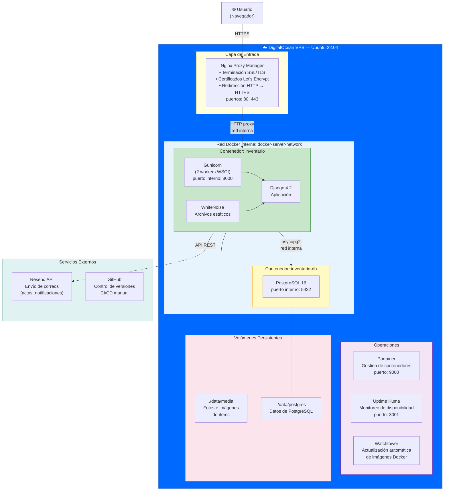
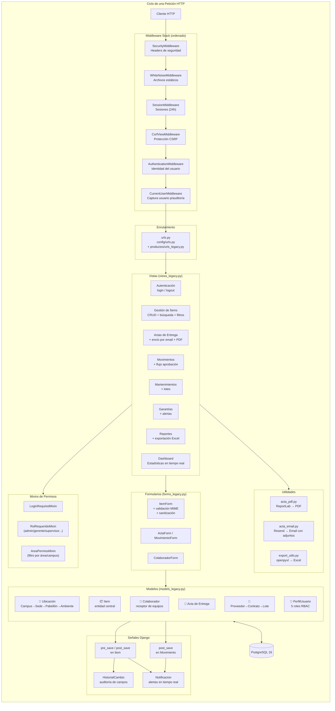
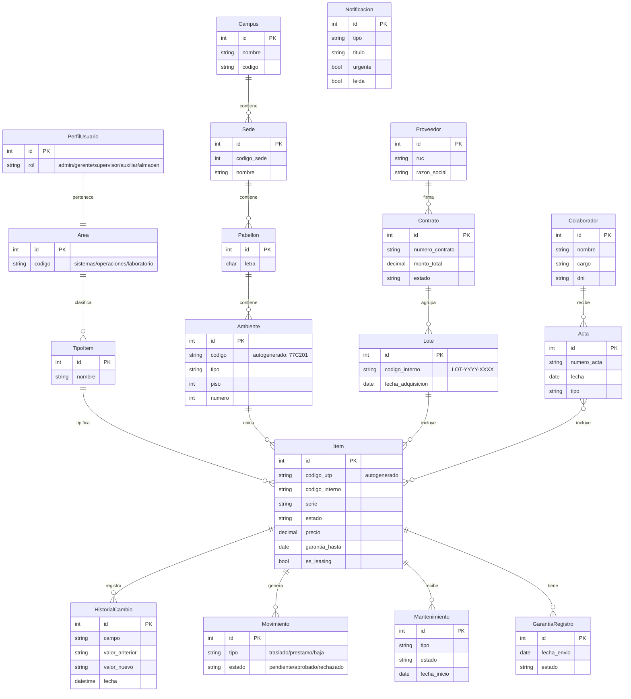
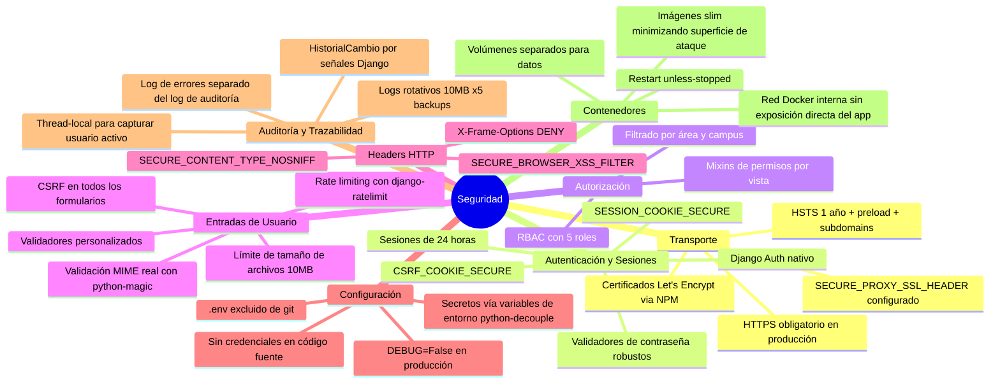
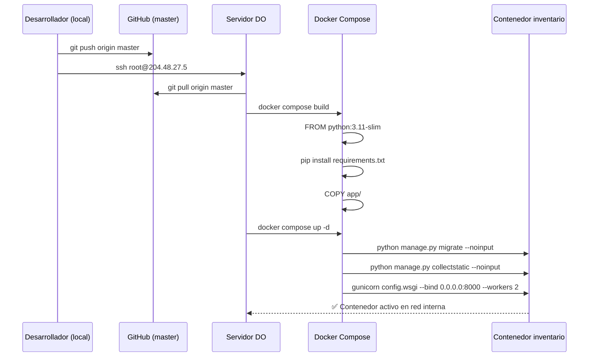

# Diagrama de Arquitectura — Sistema de Inventario UTP

> Stack: Python 3.11 · Django 4.2 · PostgreSQL 16 · Docker · DigitalOcean

---

## 1. Arquitectura de Infraestructura

---

## 2. Arquitectura de la Aplicación Django

---

## 3. Modelo de Dominio (Entidades Clave)

---

## 4. Seguridad Implementada

---

## 5. Flujo de Despliegue

---

## Resumen Técnico

| Componente | Tecnología | Justificación |
|---|---|---|
| Lenguaje | Python 3.11 | Versión LTS estable, tipado mejorado |
| Framework | Django 4.2 LTS | Baterías incluidas, ORM robusto, admin |
| Base de datos | PostgreSQL 16 | ACID compliant, escalable |
| WSGI | Gunicorn 2 workers | Concurrencia en producción |
| Archivos estáticos | WhiteNoise | Sin dependencia de Nginx para estáticos |
| Contenedores | Docker + Compose | Reproducibilidad, aislamiento |
| Proxy/SSL | Nginx Proxy Manager | Terminación SSL centralizada, multi-proyecto |
| Email | Resend API | Entregabilidad alta, SPF/DKIM incluido |
| PDF | ReportLab | Generación de actas sin dependencias externas |
| Excel | openpyxl | Importación masiva de inventario |
| Seguridad archivos | python-magic | Validación MIME real (no solo extensión) |
| Rate limiting | django-ratelimit | Protección contra ataques de fuerza bruta |
| Variables de entorno | python-decouple | Separación config/código (12-factor app) |
| Auditoría | Django Signals | Historial automático sin modificar modelos |
| Control de versiones | Git + GitHub | Historial completo, 15+ commits documentados |
| Monitoreo | Uptime Kuma | Alertas de disponibilidad 24/7 |
